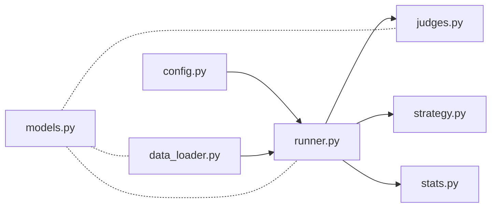

# Evaluation Module

This module evaluates AI agent benchmark traces using LLM judges. It is a
**post-benchmark** step: it reads the trace JSON files produced by the benchmark
runner, scores them against ground-truth answers, and produces per-model reports
with confidence intervals and optional cross-model significance tests.

## Architecture



**End-to-end flow:**

1. Load configuration from YAML (or fall back to defaults).
2. Load ground-truth answers from the dataset CSV and discover model / trial
   directories under the benchmark traces path.
3. For each **model -> question -> trial**: load the trace file, run all
   applicable judges, and collect scores.
4. Aggregate scores per question across trials (mean, std, confidence interval).
5. Optionally run paired significance tests across models.
6. Write JSON reports, CSV summaries, and print a human-readable summary.

## Module Files

| File | Purpose |
| --- | --- |
| `config.py` | `EvalConfig` and `JudgeConfig` dataclasses; YAML config loading via `load_eval_config()` |
| `models.py` | Pydantic data models for every evaluation entity (scores, reports, comparisons, metrics) |
| `data_loader.py` | Loads the ground-truth CSV and benchmark trace JSON files; discovers trial directories |
| `judges.py` | Four LLM judge functions that use OpenAI structured outputs |
| `strategy.py` | Maps question categories to the appropriate judge strategy |
| `stats.py` | Confidence-interval computation and paired significance tests |
| `runner.py` | Main pipeline orchestrator; the public entry point is `run_evaluation()` |

## Judges

Every question is evaluated by three judges. Two run unconditionally (approach
and sources), while the third is selected by category (accuracy **or**
attributes).

### Approach

`judge_approach` rates how well the agent's methodology matches the suggested
expert approach. It examines problem framing, data-source selection, analytical
steps, and tool usage.

- Raw scale: **1 -- 5** (5 = expert-like, 1 = wrong approach).
- Normalized to **0 -- 1** in the final report: `(raw - 1) / 4`.

### Accuracy

`judge_accuracy` checks numerical and factual correctness against the expected
answer, respecting configurable absolute and relative tolerances.

- Raw scale: **0 -- 1** (used directly, no normalization needed).
- Only used for questions in the **"Market data retrieval and analysis"**
  category.

### Attributes

`judge_attributes` extracts up to five key attributes from the expected answer
and checks whether the agent's answer contains each one (or a reasonable
equivalent).

- Raw scale: **0 -- 1** alignment score.
- Used for **all categories except** "Market data retrieval and analysis".

### Sources

`judge_sources` evaluates the authority, alignment, and appropriateness of the
sources cited or implied in the agent's answer.

- Raw scale: **1 -- 5** (5 = authoritative and well-aligned).
- Normalized to **0 -- 1**: `(raw - 1) / 4`.

All judges use OpenAI structured outputs (`client.responses.parse`) with
`temperature=0` for reproducibility. The judge model defaults to `gpt-4o` and
can be overridden via config or the `--judge-model` CLI flag.

## Strategy Routing

`strategy.py` decides which accuracy-style judge to use based on the question
category:

| Category | Strategy | Judge |
| --- | --- | --- |
| Market data retrieval and analysis | `accuracy` | `judge_accuracy` |
| Everything else | `attributes` | `judge_attributes` |

## Statistical Analysis

### Per-question score statistics

When a question is run across multiple trials, the scores for each dimension
(approach, accuracy, sources) are aggregated by `compute_score_statistics()`:

- **Mean** and **standard deviation** over all trial scores.
- **Confidence interval** using the Student's *t*-distribution:

  ```
  CI = mean +/- t_crit * (std / sqrt(n))
  ```

  where `t_crit = scipy.stats.t.ppf(1 - alpha/2, df=n-1)` at the configured
  confidence level (default 95%).

- For `n = 1` the CI collapses to the single observation. For `n = 0` all
  values are zero.

Aggregate statistics across all questions are computed the same way, using each
question's mean score as the input.

### Cross-model paired comparison

When `--compare` is enabled, `compare_models_paired()` runs a paired test for
every combination of two models, independently for each scoring dimension.

**Test selection** depends on sample size (number of shared questions with
non-zero score differences):

- **n >= 6**: Wilcoxon signed-rank test (non-parametric, no normality
  assumption). Effect size is `W / (n * (n + 1) / 2)`.
- **n < 6**: paired *t*-test fallback. Effect size is Cohen's *d*:
  `|mean_a - mean_b| / pooled_std`.

**Edge cases:**

- If all pairwise differences are zero the result is `exact_tie` with `p = 1.0`.
- A result is marked `significant` when `p_value < alpha` (default 0.05).

The output includes a `direction` field (`a>b`, `b>a`, or `equal`) so you can
tell which model performed better on that dimension.

## Configuration

The pipeline is configured via `configs/eval_config.yaml` (or sensible
defaults). Key settings:

```yaml
judge:
  provider: openai
  model: gpt-4o
  temperature: 0.0
  max_tokens: 4096

results_path: ./benchmark_traces
dataset_path: ./data/eval_samples_with_answers.csv
output_dir: ./evaluation_results

# run_name: eval_samples

tolerances:
  abs_tol: 0.01
  rel_tol: 0.5

statistics:
  confidence_level: 0.95
  significance_alpha: 0.05

# models:
#   - openai_gpt-4.1
#   - anthropic_claude-sonnet-4-20250514

# questions: [1, 3, 5]
```

All paths are resolved relative to the project root. CLI arguments override
config-file values.

## Expected Input Directory Layout

The evaluation module auto-discovers models and trials from the benchmark traces
directory.

**Single-trial** (no `trial_N/` subdirectories):

```
benchmark_traces/
  eval_samples/                          # run_name
    openai_gpt-4.1/                      # model dir (auto-discovered)
      trace_q1_20260215_1423.json
      trace_q2_20260215_1425.json
    anthropic_claude-sonnet-4-20250514/
      trace_q1_20260215_1430.json
      ...
```

**Multi-trial** (benchmark ran with `num_trials > 1`):

```
benchmark_traces/
  eval_samples/
    openai_gpt-4.1/
      trial_1/
        trace_q1_20260215_1423.json
        trace_q2_20260215_1425.json
      trial_2/
        trace_q1_20260215_1523.json
        trace_q2_20260215_1525.json
      trial_3/
        ...
    anthropic_claude-sonnet-4-20250514/
      trial_1/
        ...
      trial_2/
        ...
```

**Discovery rules:**

- Every non-hidden subdirectory under `results_path/{run_name}/` is treated as a
  model.
- Each model directory is scanned for `trial_N/` subdirectories. When none
  exist the pipeline falls back to single-trial mode.
- Trace files are matched by `trace_q{N}_*.json`. If multiple files match, the
  most recently modified one is used.
- `config.models` and `config.questions` can narrow the scope to specific models
  or question IDs.

## Usage

Run via the CLI script `scripts/run_eval.py`.

**Defaults** (all models, all questions):

```bash
python scripts/run_eval.py
```

**Specific run name** (matches the benchmark `run_name`):

```bash
python scripts/run_eval.py --run-name eval_samples
```

**Single model**:

```bash
python scripts/run_eval.py --run-name eval_samples --model openai_gpt-4.1
```

**Subset of questions**:

```bash
python scripts/run_eval.py --questions 1,3,5
```

**Multiple models with cross-model comparison**:

```bash
python scripts/run_eval.py --run-name eval_samples --compare
```

**Override the judge model**:

```bash
python scripts/run_eval.py -c configs/eval_config.yaml --judge-model gpt-4.1
```

**Multi-trial runs** need no special flag. The pipeline auto-discovers
`trial_N/` directories and aggregates scores across trials with confidence
intervals.

## Output

**Single-trial:**

```
evaluation_results/
  eval_samples/
    openai_gpt-4.1/
      report.json       # full model report with aggregate stats
      summary.csv       # one row per question
      q1.json           # per-question detail
      q2.json
    eval_config.yaml    # snapshot of the config used
```

**Multi-trial** (adds `trial_N/` subdirectories for per-trial details):

```
evaluation_results/
  eval_samples/
    openai_gpt-4.1/
      report.json       # aggregate stats across all trials
      summary.csv       # per-question means with confidence intervals
      trial_1/
        q1.json         # trial 1 detail for question 1
        q2.json
      trial_2/
        q1.json
        q2.json
    anthropic_claude-sonnet-4-20250514/
      report.json
      summary.csv
      trial_1/
        ...
    comparison_report.json   # only when --compare is used
    eval_config.yaml
```

**File contents:**

- `report.json` -- per-question `QuestionEval` entries with `ScoreStatistics`
  for each dimension, plus aggregate stats across all questions.
- `summary.csv` -- flat CSV with columns: `question_id`, `category`,
  `difficulty`, `strategy`, `approach_mean`, `approach_ci`, `accuracy_mean`,
  `accuracy_ci`, `sources_mean`, `sources_ci`, `tool_calls`, `tokens`,
  `duration_s`.
- `comparison_report.json` -- pairwise `ModelComparison` results across all
  model pairs and scoring dimensions (approach, accuracy, sources).

## Dependencies

| Package | Used for |
| --- | --- |
| `openai` | LLM judge calls via structured outputs |
| `pydantic` | Data models and validation |
| `pyyaml` | Config file parsing |
| `scipy` | Student's *t*-distribution CIs and significance tests (Wilcoxon, paired *t*) |
